# homework-iptables

Описание домашнего задания
---

1. реализовать knocking port
centralRouter может попасть на ssh inetrRouter через knock скрипт


2. добавить inetRouter2, который виден(маршрутизируется (host-only тип сети для виртуалки)) с хоста или форвардится порт через локалхост.

   
3. запустить nginx на centralServer.

   
4. пробросить 80й порт на inetRouter2 8080.


---
ОС для настройки: ubuntu 22_04 (7 виртуальных машин)

Vagrant версии 2.4.1

VirtualBox версии 7.0.18

---
- Этап 1: реализовать knocking port

**Настраиваем правила iptables на inetRouter**

```bash
# Generated by iptables-save v1.8.7
*filter
:INPUT DROP [0:0]
:FORWARD ACCEPT [0:0]
:OUTPUT ACCEPT [0:0]
:TRAFFIC - [0:0]
:SSH-INPUT - [0:0]
:SSH-INPUTTWO - [0:0]
# Completed on Thu Jul  4 04:37:16 2024
# Generated by iptables-save v1.8.7 on Thu Jul  4 04:37:16 2024
-A INPUT -j TRAFFIC
-A SSH-INPUT -m recent --set --name SSH1 --mask 255.255.255.255 --rsource -j DROP
-A SSH-INPUTTWO -m recent --set --name SSH2 --mask 255.255.255.255 --rsource -j DROP
-A TRAFFIC -p icmp -m icmp --icmp-type any -j ACCEPT
-A TRAFFIC -m state --state RELATED,ESTABLISHED -j ACCEPT
-A TRAFFIC -p tcp -m state --state NEW -m tcp --dport 22 -m recent --rcheck --seconds 30 --name SSH2 --mask 255.255.255.255 --rsource -j ACCEPT
-A TRAFFIC -p tcp -m state --state NEW -m tcp -m recent --remove --name SSH2 --mask 255.255.255.255 --rsource -j DROP
-A TRAFFIC -p tcp -m state --state NEW -m tcp --dport 6666 -m recent --rcheck --name SSH1 --mask 255.255.255.255 --rsource -j SSH-INPUTTWO
-A TRAFFIC -p tcp -m state --state NEW -m tcp -m recent --remove --name SSH1 --mask 255.255.255.255 --rsource -j DROP
-A TRAFFIC -p tcp -m state --state NEW -m tcp --dport 5555 -m recent --rcheck --name SSH0 --mask 255.255.255.255 --rsource -j SSH-INPUT
-A TRAFFIC -p tcp -m state --state NEW -m tcp -m recent --remove --name SSH0 --mask 255.255.255.255 --rsource -j DROP
-A TRAFFIC -p tcp -m state --state NEW -m tcp --dport 4444 -m recent --set --name SSH0 --mask 255.255.255.255 --rsource -j DROP
-A TRAFFIC -j DROP
COMMIT
```

```bash
/sbin/iptables-restore < /etc/iptables_rules.ipv4
```

PS. Надо быть осторожным с этими правилами, я намудрил немного и меня самого выкинуло с сервера :D

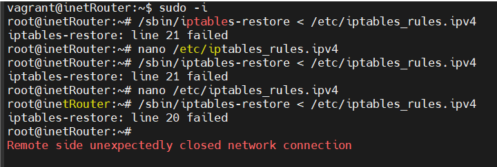


**Включаем START_KNOCKD=1 в /etc/default/knockd**


```bash
nano /etc/default/knockd
# control if we start knockd at init or not
# 1 = start
# anything else = don't start
# PLEASE EDIT /etc/knockd.conf BEFORE ENABLING
START_KNOCKD=1

# command line options
#KNOCKD_OPTS="-i eth1"
```

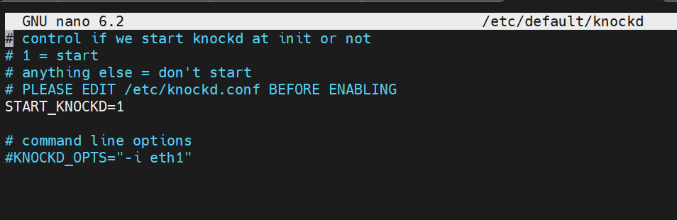


**Делаем юнит /etc/systemd/system/knockd.service для knockd**

```bash
nano /etc/systemd/system/knockd.service

[Unit]
Description=Port-Knock Daemon
After=network.target
Requires=network.target
Documentation=man:knockd(1)

[Service]
EnvironmentFile=-/etc/default/knockd
ExecStartPre=/usr/bin/sleep 1
ExecStart=/usr/sbin/knockd $KNOCKD_OPTS
ExecReload=/bin/kill -HUP $MAINPID
KillMode=mixed
Restart=always
SuccessExitStatus=0 2 15
ProtectSystem=full
CapabilityBoundingSet=CAP_NET_RAW CAP_NET_ADMIN

[Install]
WantedBy=multi-user.target
```

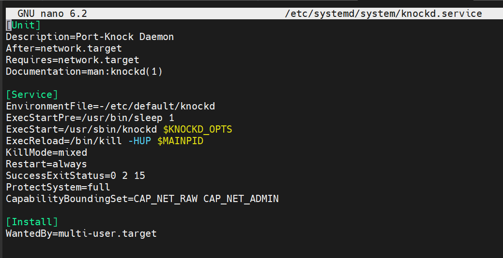


**Редактируем конфигурацию /etc/knockd.conf**, указываем порты для knock


```bash
[options]
        UseSyslog
        Interface = eth1

[opencloseSSH]
        sequence      = 4444:tcp,5555:tcp,6666:tcp
        seq_timeout   = 15
        tcpflags      = syn
        start_command = /sbin/iptables -I INPUT 1 -s %IP% -p tcp --dport 22 -j ACCEPT
        cmd_timeout   = 30
        stop_command  = /sbin/iptables -D INPUT -s %IP% -p tcp --dport ssh -j ACCEPT
```

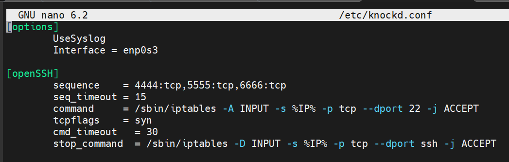


**Запускаем**


```bash
systemctl start knockd
```


**Пытаемся подключиться, отваливаемся по таймауту, потом "СТУЧИМСЯ" правильно, и подключаемся.**

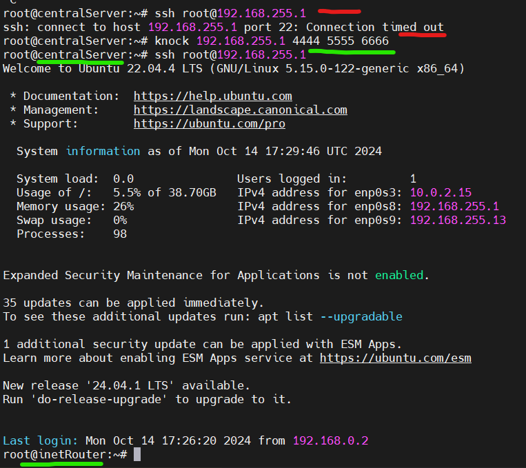


---
- Этап 2: добавить inetRouter2, пробросить порт


**Для удобства воспользуемся стендом из ДЗ архитектура сетей** с небольшим дополнением. Создадим еще одну VM inetRouter2

```bash
#Отключаем фаервол
systemctl stop ufw
systemctl disable ufw
```

```bash
#Настраиваем транзитные пакеты
echo "net.ipv4.conf.all.forwarding = 1" >> /etc/sysctl.conf
sysctl -p
sysctl net.ipv4.ip_forward
nano /etc/netplan/50-cloud-init.yaml
```

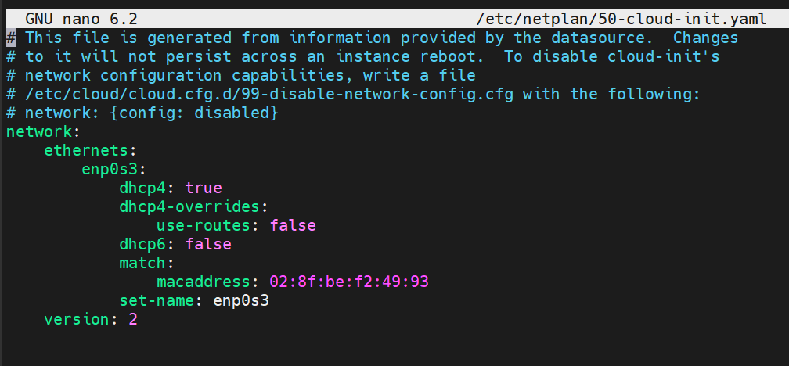


```bash
nano /etc/netplan/50-vagrant.yaml
netplan try
```

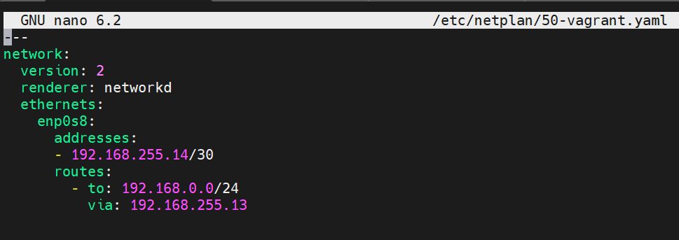


**Настраиваем правала для проброса портов**


```bash
nano /etc/iptables_rules.ipv4


# Generated by iptables-save
*nat
:PREROUTING ACCEPT [0:0]
:INPUT ACCEPT [0:0]
:OUTPUT ACCEPT [0:0]
:POSTROUTING ACCEPT [0:0]
-A PREROUTING -p tcp -m tcp --dport 8080 -j DNAT --to-destination 192.168.0.2:80
-A POSTROUTING -d 192.168.0.2/32 -o enp0s8 -p tcp -m tcp --dport 80 -j SNAT --to-source 192.168.255.14:8080
COMMIT
# Completed
```

```bash
/sbin/iptables-restore < /etc/iptables_rules.ipv4
iptables-save
```


**+ на inetRouter** добавляем интерфейс. PS. тут я конечно чего-то залип, минут 20 пытался понять, чего пинги не идут, а куда они пойдут без сетевой связанности :D


```bash
nano /etc/netplan/50-vagrant.yaml

#Добавляем
    enp0s9:
      addresses:
      - 192.168.255.13/30

netplan try
```

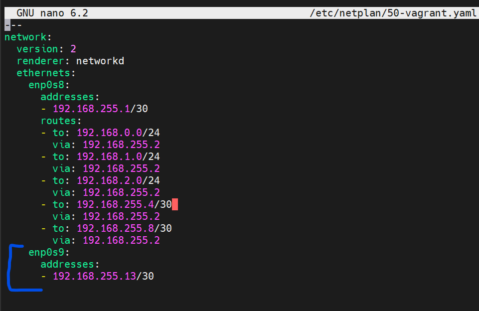


**Устанавливаем nginx** на centralServer

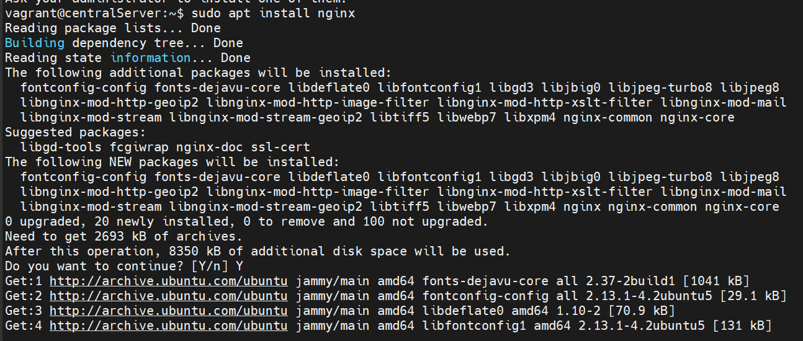
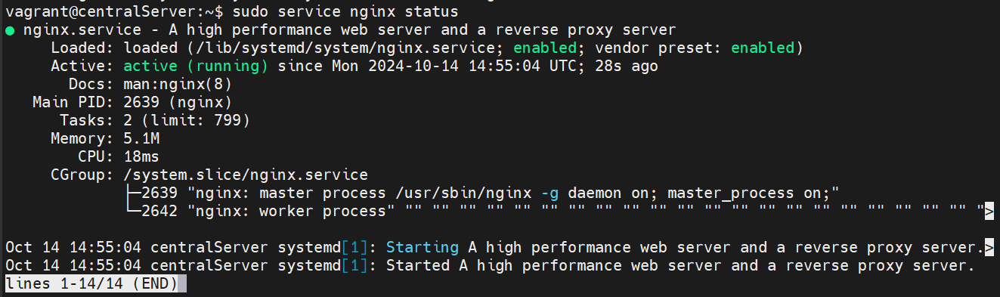


**Проверяем проброс портов** Стучимся с inetRouter2 по 192.168.0.2:80, и попадаем на nginx, которые установлен на centralServer


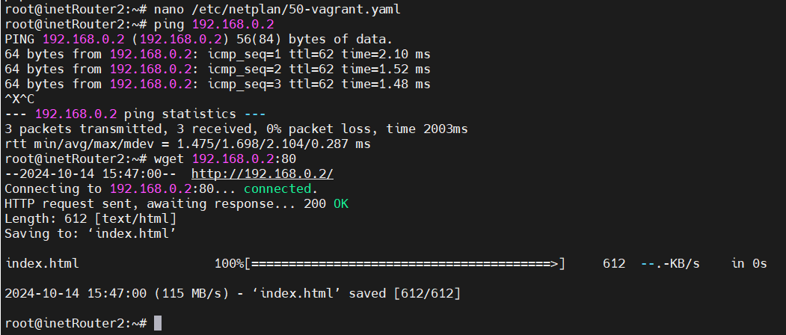
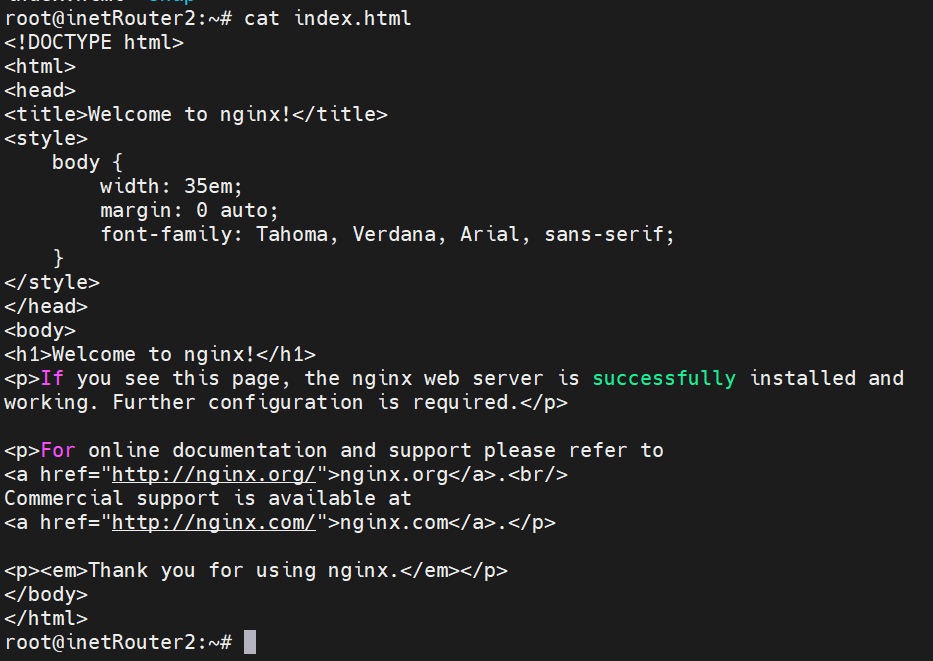

